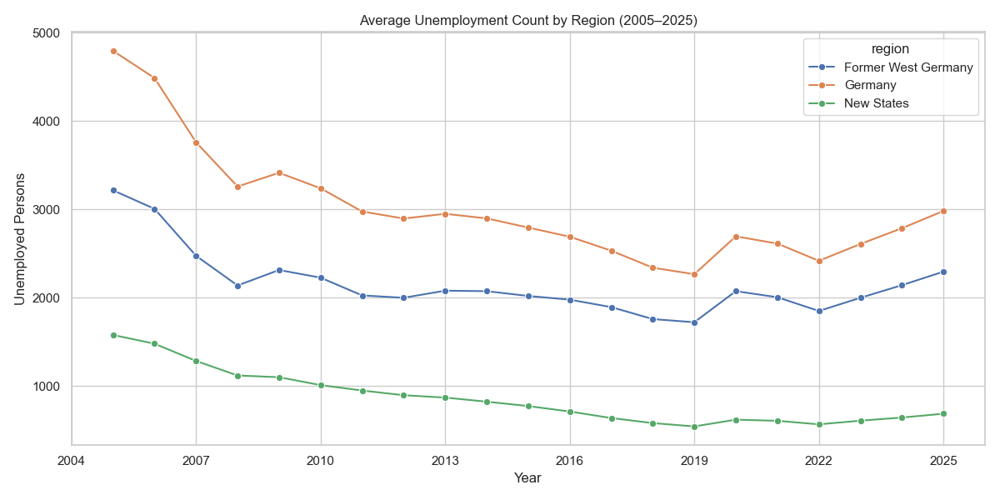
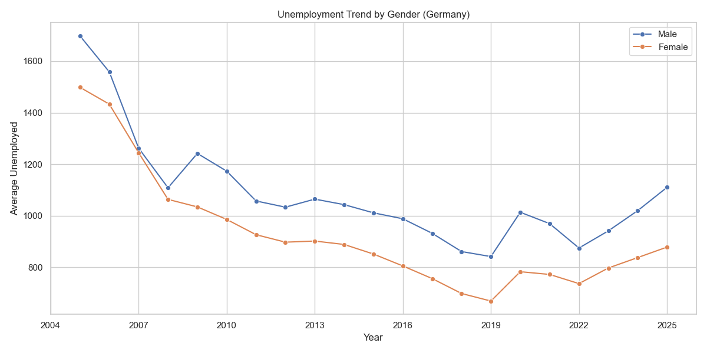
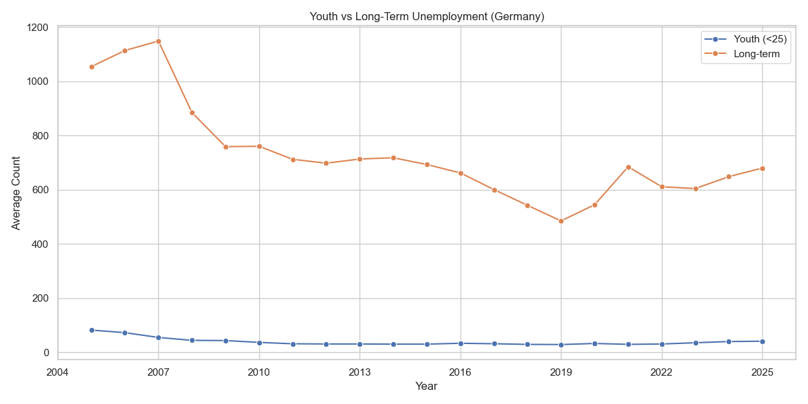

# 🇩🇪 German Unemployment Analytics Pipeline

**A PySpark-based ETL pipeline for processing official unemployment statistics from the Federal Employment Agency (BA Statistik)**

[](https://spark.apache.org/)
[](https://python.org)
[](LICENSE)

---

## 📌 Key Features

- 🔄 **ETL Pipeline with PySpark**
  - Reads raw `.csv` files from BA Statistik (2005–2025)
  - Skips malformed rows, standardizes structure, adds metadata
- 🧱 **Schema-Driven Design**
  - Explicit Spark schemas for each dataset category
- 📊 **Time-Series Ready**
  - Parses dates, extracts `year` and `month`, and aggregates over time
- 📦 **Outputs to Parquet**
  - Clean data is saved in optimized columnar format
- 🌐 **Visualizations Added**
  - Line plots showing trends across years and categories

---

## 📂 Dataset Categories

| Category             | Examples                                | Scope                  |
|----------------------|-----------------------------------------|------------------------|
| Unemployment Count   | `arbeitslose_deutschland_originalwert.csv` | Germany, East, West    |
| Unemployment Rate    | `arbeitslosenquote_*.csv`               | Germany, East, West    |
| Seasonally Adjusted  | `kurzarbeiter_bv41.csv`, `stellen.csv` | National Level         |

---

## 🛠️ Tech Stack

| Layer        | Tool           |
|--------------|----------------|
| Processing   | PySpark        |
| Storage      | Parquet Files  |
| Scripting    | Python 3.12    |
| Visualization| Matplotlib, Seaborn |
| IDE Tested On| VSCode + MacOS |

---

## 🚀 Getting Started

### 🔧 Prerequisites

```bash
# Install Python & Java
brew install python openjdk@11

# Set up virtual environment
python -m venv venv
source venv/bin/activate
pip install -r requirements.txt
```

### 📂 Project Structure
```
SPARK-ETL-PROJECT/
├── config/
│   └── schemas.py             # Spark schemas
├── Data/
│   ├── Raw/                   # Input CSVs
│   └── processed/             # Output Parquet files
├── outputs/                  # Saved visualization images
├── scripts/
│   ├── load.py                # ETL driver
│   ├── transform.py           # Column transformation & metadata
│   ├── analyze.py             # Time-based aggregations
│   └── visualize.py           # Matplotlib/Seaborn visualizations
├── requirements.txt
└── README.md
```

---

## 📅 How to Run the Pipeline

```bash
# 1. Activate virtual environment (if not already)
source venv/bin/activate

# 2. Run the ETL process
python scripts/load.py

# 3. Run data analysis
python scripts/analyze.py

# 4. Generate graphs
python scripts/visualize.py
```

---

## 🔍 Sample Visual Output
> Output graphs are saved in the `outputs/` directory.

### 📈 Unemployment Over Time


### 🧑‍🤝‍🧑 Gender-wise Unemployment Trend


### 👶 Youth vs Long-term Unemployment



---

## 📊 Showcase This Project 

> "Developed a PySpark-based ETL pipeline for time-series analysis of German unemployment data. Integrated multi-source datasets, enforced schema-driven validation, and automated visual reporting using Matplotlib."

---

## ✅ License